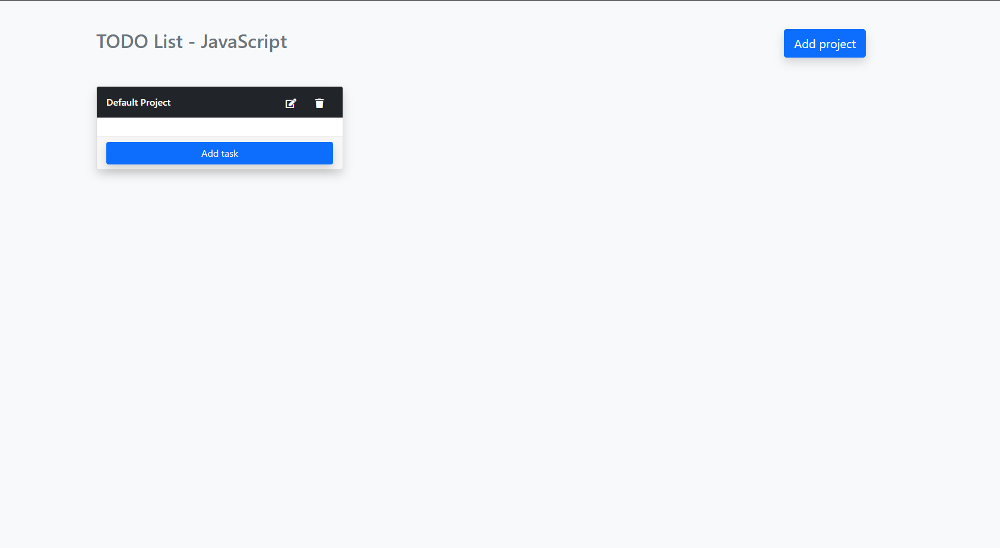

# To-Do-List

> This project was built as part of the Microverse JavaScript module. The goal of the project is to build a simple Todo App using Webpack and ES6 by dynamically creating the DOM elements.



Additional description about the project and its features.

## Built With

- HTML5
- CSS3
- Bootstrap5
- JavaScript
- Babel
- Webpack
- localStorage


## Getting Started

In order to run locally this project type the following commands over the terminal in Linux or Mac or the Windows cmd console:

```s
$ git clone https://github.com/prernapriyali/to-do-list-microverse


```$ cd To-Do-List-Microverse
$ npm install

```

After running the previous commands, to see the web application in the browser go to the `To-Do-List` folder and open the `index.html` file inside `dist` folder.


## Test

To run the integration Tests locally using [Jest](https://jestjs.io/), just type the following commands over the terminal in Linux or Mac or the Windows cmd console:

```s
$ npm run test


## Authors

👤 **Prerna Priyali**

- Github: [@prernapriyali](https://github.com/prernapriyali)
- Twitter: [@twitterhandle](https://twitter.com/prerna96440861)


## 🤝 Contributing

Contributions, issues, and feature requests are welcome!

Feel free to check the [issues page](https://github.com/prernapriyali/to-do-list-microverse/issues).

## Show your support

Give a ⭐️ if you like this project!

## 📝 License

This project is [MIT](lic.url) licensed.
